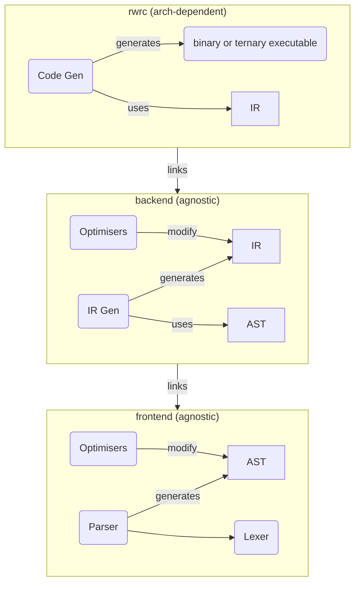

# Dependency Structure

Most of the code [pipeline](./pipeline.md) is common for all (or most) hardware architectures. The Clawr source code is hardware agnostic and the same code can be compiled for any hardware. The AST — and maybe even the IR — should also be agnostic to the target hardware and operating system.

To build a compiler targeting specific hardware or a particular operating system, the key step is *Code Gen*. The final step of the pipeline generates the machine code and packages it for the target architecture. This step is not likely to be reusable, but must be custom built. Of course, the compiler may bundle support for multiple targets and allow the user to select from them using a command-line option or a settings file. But even then, each target architecture will need its own Code Gen implementation.

The Code Gen step does not know Clawr syntax at all, but gets its instructions from a specification called the *intermediate representation* (IR). The structure for this representation is defined by the common backend (unless the compiler itself implements its own custom backend pipeline).

The backend gets its input in the form of an abstract syntax tree (AST). This is defined by the common frontend. The common frontend is nonnegotiable. It is the tool that parses the Clawr source code and it must interpret the same code the same way regardless of target architecture.

