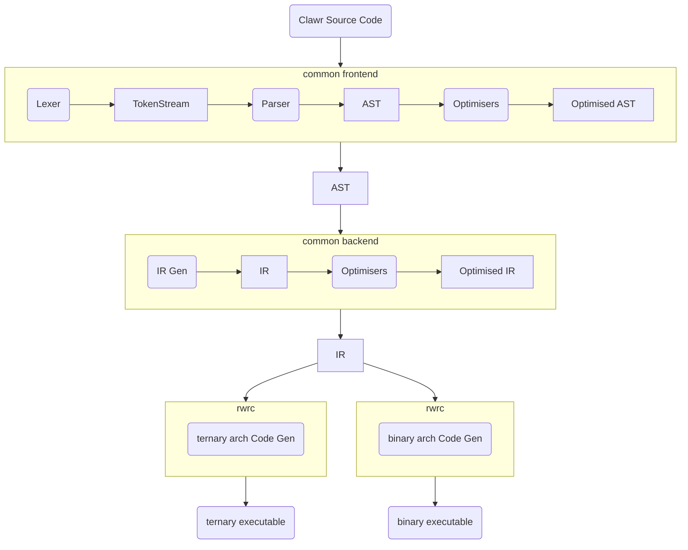

# the Pipeline

Most of the code pipeline is common for all hardware architectures. The Clawr source code is hardware agnostic and the same code can be compiled for any hardware.

The code is processed by a common frontend that converts it into a stream of tokens that are then parsed and structured into an abstract syntax tree (AST). The AST is reduced in a Haskell-inspired process before being sent on to the backend.

The backend translates the AST into a different format called an intermediate representation (IR). The IR is meant to make the final output easy to generate. The PoC generates C code that is compiled by the clang compiler. The IR is essentially a structured version of that C code. Future implementations could utilise a common backend that generates LLVM IR, or they could reimplement the entire backend to their own liking.

The IR is sent to a final codegen step that generates the binary (or ternary) executable. This step **must** be[ implemented independently](./dependencies.md) for each target architecture. Of course, support for multiple architectures could be bundled as a single compiler executable and selected using command-line flags or settings.

