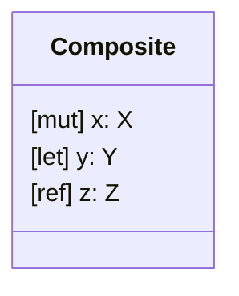
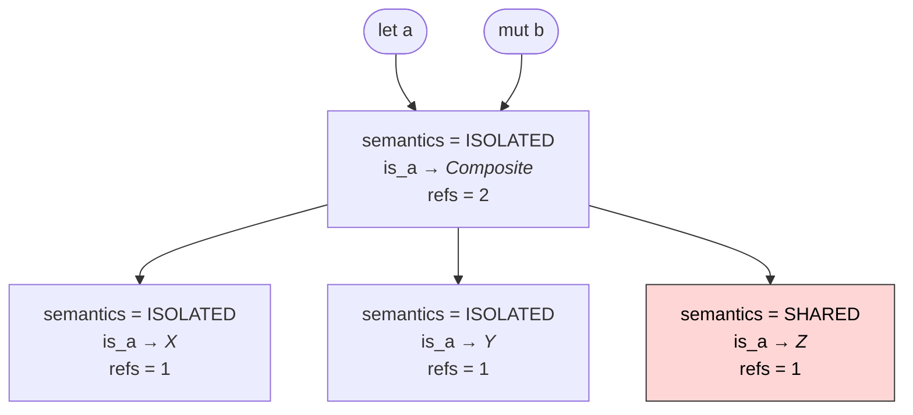
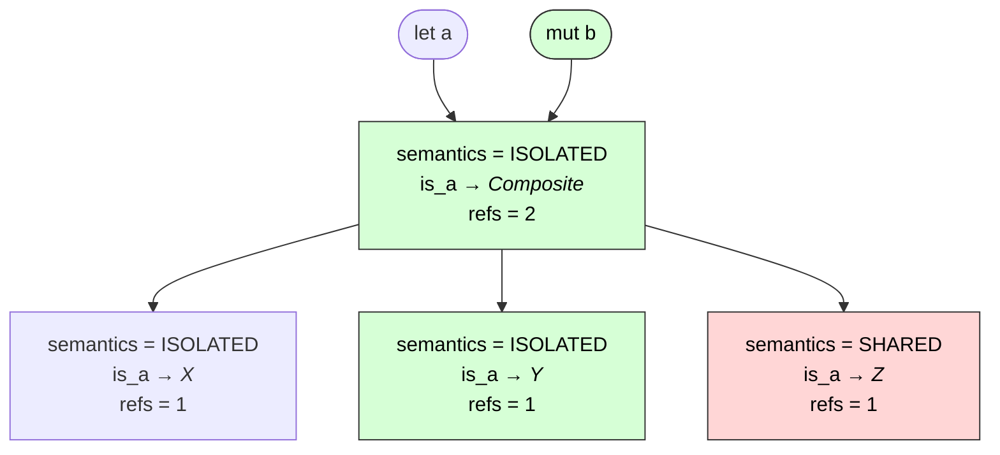
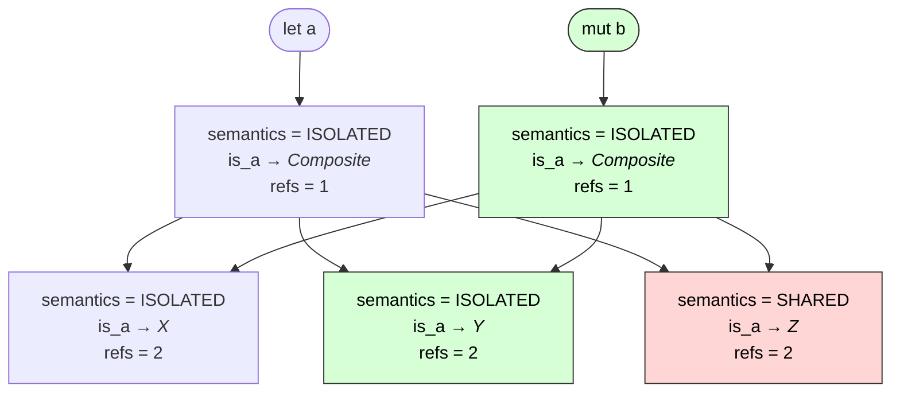
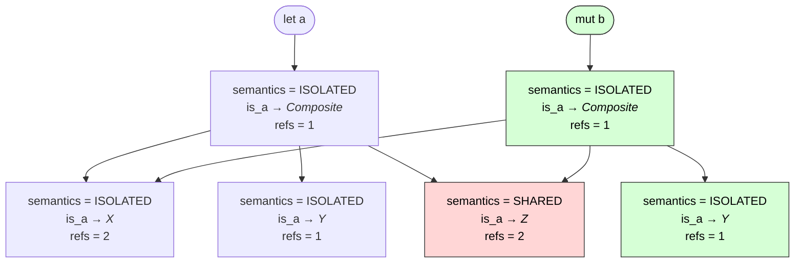

# **Copy-on-Write Mutation (Rawry’s Law of Claws)**

[](./rawry.md)
Rawry hates accidental sharing.

He hates it with the fiery, domain-defending passion of a lion who has read one “clever” piece of code too many.

In Clawr, values travel through your program with well-defined _semantics_—`let`, `mut`, and `ref`—and Rawry makes sure you can always trust the promises made by these keywords:

- `let`: “This is a ‘constant,’ a named value that can never change”
- `mut`: “This is my ‘container’ that only I can manipulate”
- `ref`: “This is a reference to a shared structure that can I and others can manipulate”

But one situation terrifies him more than anything else:

> A variable claims to be an isolated container or a constant value… but some _other_ variable is secretly looking at the same structure in memory.

This is the nightmare of aliasing, and without Rawry to intervene, it would surely cause invalid mutations and general confusion.

As soon as a mutation is attempted, Rawry blocks it to enforce what we call **Copy-on-Write**.

---

## When You Modify Something, Rawry Checks Who Else Is Watching

Let’s imagine this simple data structure:


At some point two variables were assigned the same data:

```clawr
let a: Composite = { x: {...}, y: {...}, z: {...} }
mut b = a
```

Conceptually, these are two separate structures that just happen to be identical.

In memory, however, actually replicating structures is expensive, so as long as neither vriable is changed, they can reference the same memory address:



Consider the following innocent-looking mutation:

```clawr
b.y.value = 1
```

This seems simple enough: modify the `y` structure of `b`.  But Rawry grows suspicious. He looks at the runtime memory graph and asks:

- Does `b` require isolation?
- Does anything else point at the same underlying data?
- Will this mutation leak into another part of the program?

If the answer is _yes_, then Rawry bares his claws.

He does not let you mutate shared state. Instead, he performs a precise, controlled sequence:

1. **Isolate the mutated memory** (by cloning memory as necessary)
2. **Then—and only then—he allows the mutation**

This ensures that your change affects **only your variable** and not anyone else’s.

### The Mutation Path

Here is the mutation path highlighted:


Rawry will have to look at each of the memory blocks on the path and isolate them in the right order.

---

## **Step 1 — Isolating the Root**

When you make a deep assignment like `b.y.value = 1`, Rawry starts by examining the memory block referenced by the root variable `b`.

If its semantics say:

```
semantics = ISOLATED
refs > 1
```

then `b` requires isolation, but shares memory with other variables.

Rawry will not tolerate this, so he makes a **shallow copy** of the root `Composite` block.

This clone:

- gets its own memory
- points to the same children (`x`, `y`, `z`)
- increments their reference counts
- and is now exclusively owned by `b`

Meanwhile, the other variables (only `a` in the example) that referenced the original memory continue pointing to that and are now isolated from `b`.



But Rawry is not satisfied. The root of `b` is isolated, but the actual modification is performed deeper down in the structure. He will have to repeat the process for every structural element on the mutation path.

---

## **Step 2 — Isolating the Field Being Mutated**

Now Rawry turns his gaze to the field `b.y`. The memory says:

```
semantics = ISOLATED
refs = 2
```

This was 1 before the mutation attempt, but when Rawry cloned the root of the structure, all children’s reference counts were incremented, and the `Y` structure now has two references, `a.y` and `b.y`.

Once again, Rawry refuses to let a mutation proceed while multiple references exist.

So he repeats. Now the clones this field:

- The `Y` structure is cloned; `b.y` points to the new memory.
- Other children like `x` or `z` remain shared by `a` and `b`.
- Isolation is maintained _precisely at the location being mutated_




This is the heart of Clawr’s memory discipline:

> **CoW propagates only along the mutation path.**  
> Never more, never less.

Rawry doesn’t believe in wasteful deep copies. He only separates ownership where mutation actually occurs.

---

## **Step 3 — The Actual Mutation**

At this point:

- `b` owns its own isolated root
- `b.y` is its own isolated child
- all reference counts along the mutation path are exactly 1

Now Rawry steps aside.

The mutation may proceed safely.

No other variable observes the mutation, and the integrity of the entire memory graph is preserved.

---

## **Why This Matters**

Clawr’s Copy-on-Write rules aren’t an optimisation trick. They are a _safety guarantee_ that upholds the language’s core philosophy:

- **Purity is explicit**
- **Mutability is disciplined**
- **Ownership is always known**
- **Aliasing must never surprise you**

Rawry’s Law is simple:

> _If a mutation might hurt someone else, make a private copy first._

Clawr enforces this automatically, so developers stay focused on the domain—not the bookkeeping.

---

## **A Final Word from Rawry**

Rawry doesn’t hate code. He hates _careless_ code—in particular the kind that mutates data behind someone’s back.

Copy-on-Write mutation in Clawr is Rawry’s way of keeping the peace:

- No unexpected sharing
- No accidental side effects
- No invisible coupling
- No cleverness required

Just **clean, understandable, domain-driven behaviour**.

---

## A Mental Model

### `ref` variable: A Reference to Some *Thing*

You can think of a `ref` variable is as a hand. It is a *reference* to some structure somewhere in the system. The hand might grab onto a structure, manipulate it or reference it for a while, and then let go of it. Or it might hold on to a single structure forever.

Multiple hands can reach for the same structure. When any hand manipulates it, all hands are affected by the change because they're all interacting with the same *thing*. This is shared mutable state. And it might be how many programmers think of object-oriented programming.

The `ref` keyword is analogous to `class` types in other languages (e.g. Java, C#, Swift…). It indicates *reference semantics*.

### `mut` variable: A Data Container

A `mut` variable is like a drawer or a box. You can reach inside the drawer and manipulate its contents. You can copy the contents of one drawer into another, but you can never make two drawers “become the same drawer.” This means that variables can never change one another’s content. No drawer can be changed unless it is explicitly referenced, and no change to a drawer can cause unexpected side-effects outside the drawer itself.

This is *isolation semantics* (a.k.a. “copy semantics” or “value semantics”). The `mut` keyword is analogous to `struct` in languages like C# and Swift—where the semantics model is defined by the type.

### `let` variable: A Named Value or a Definition

A `let` variable is essentially an assigned name for a particular value—what we might call a “*constant*.” The value can be a number (like $π$ or the integer 6) or a more complex structure (like GPS coordinates or the current configuration of your program). We could also say that we *define* the constant when we assign a value to it. Once defined, the constant is fixed.

A value cannot change and still remain the same value. Similarly, a `let` variable is immutable and can only refer to its initial contents. Even if the named value is a large data structure—with arbitrarily many layers of nested structures—the variable itself is locked to the initial combination of field values. Even the tiniest change to that structure would construct a new value and the variable could not refer to that and still be considered constant.

The `let` keyword is analogous to `let` variables with `struct` types in Swift. The runtime implementation of `let` can be exactly the same as for `mut`; the difference is at compile-time, where the compiler disallows any action other than reads.

This is why `let` and `mut` variables can be freely assigned to each other and share memory until mutation is performed. Assigning `ref` variables to `let` or `mut`, or vice versa, require explicit copying as the semantics are incompatible, but between `let` and `mut` the `copy` operation is implicit and only occurs if/when needed.
 