# Variable Semantics Implementation Example

> [!warning]
> This should be a close match to the implementation tested in the [PoC repository](https://github.com/clawrlang/clawr-poc). Note that mistakes can happen, and implementations can change, so discrepancies are very much possible.
>
> Please consult the PoC repository directly it you are interested in what is *actually* known to work.

There are two kinds of memory structures in Clawr: `ISOLATED` and `SHARED`.

When a variable is declared as `let` or `mut`, the corresponding data structure will be flagged as the `ISOLATED` variety. This means that if there are multiple references to that structure when it is edited, the editing must be performed on a copy of the structure, not the structure itself. Only the variable that is explicitly edited may be modified. No other variables that reference the original structure may be changed. Local reasoning is a really powerful concept for understanding the state of your program. That is the contract when using `let` and `mut`.

When using `ref`, the contract says that the main subject is the referenced object (the structure in memory), not the variable. A variable is but one of potentially myriad pointers *referencing* this object. Modifying the object from one location, should instantly be reflected to all other references. Using `ref` can improve performance—as no (implicit) copying is performed—but it invalidates local reasoning. And it also adds complexity in parallel execution contexts; you will need locking or other mechanisms to ensure that two processes cannot modify the same information at the same time.

To illustrate the difference between copy and reference semantics, let’s consider a Bowling game score calculator as an example. The actual code to calculate the score is irrelevant here, but we can assume that it needs to log how many pins were knocked down (or “dropped”) by each roll of the bowling ball. Let’s imagine an encapsulated `BowlingGame` `object` type that calculates the score for a single player:

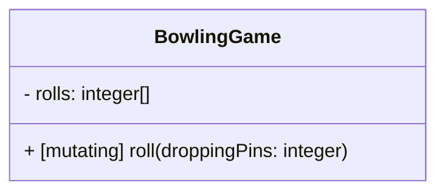

## Copy Semantics

Let’s start playing a game using a `mut` variable, and then assign the game to a different variable that we’ll continue the game through. Because we’re using `mut` variables, this will create two isolated games.

```clawr
mut game1 = BowlingGame() // Creates a new `ISOLATED` memory structure
game1.roll(droppingPins: 9)
print(game1.score) // 9

mut game2 = game1 // Temporarily references the same memory block
game2.roll(droppingPins: 1) // Mutating game2 implicitly creates a copy where the change is applied
print(game1.score) // 9 - the game1 variable has not been changed by the last roll
print(game2.score) // 10 - game2 includes the score for the second roll
```

Let’s follow the state of the memory for each line of code in the example. First a `BowlingGame` object is instantiated and assigned to the `game1` variable. We can illustrate that as follows:

```clawr
mut game1 = BowlingGame()
```

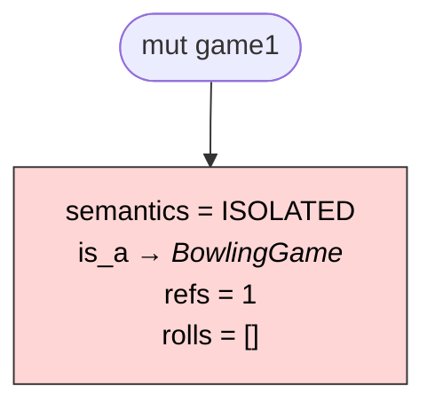

The memory holds the state of the game as defined by the `BowlingGame` object type. It also holds some data defined implicitly by the Clawr compiler. These include a `semantics` flag, an `is_a` pointer that identifies the object's type, and a reference counter (`refs`).

The `is_a` pointer is irrelevant to memory management and will be elided in the other charts on this page. It identifies the type of the object and can be used for runtime type checking. The assigned type defines the layout of the memory block. It is also used for polymorphism (looking up which function to execute for a given method call).

The `semantics` flag identifies the memory structure as belonging to a `mut` variable and hence requiring isolation, the behaviour expressed in this exchange.

The `refs` counter starts at one at allocation and is incremented with every new variable assignment. When a variable is reassigned or descoped, the counter is decremented so that it always counts exactly how many references the structure has. When the counter reaches zero the memory is released to the system for other uses.

For a local variable in a function, reference counting might be redundant, as the memory will certainly be reclaimed when the function returns. But the structure can also be referenced by another structure, and will then have to be kept around for as long as that structure maintains *its* reference.

The second line logs a roll of the bowling ball, which knocks down 9 pins. Because the `refs` counter is 1, this change is written directly into the memory without creating a copy.

```clawr
game1.roll(droppingPins: 9)
```

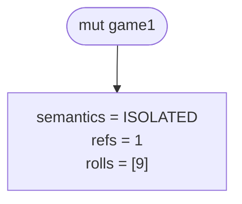

Then the new variable `game2` is assigned to the structure.

```clawr
mut game2 = game1
```

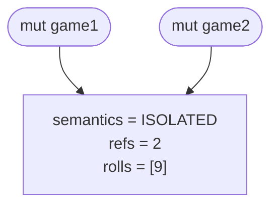

This increments the `refs` counter as there are now two variables referencing the same structure. As long as no modification is made to the structure, there is no need to maintain isolation. Both variables can reference the same memory block.

But then `game2` is modified though the `game2.roll(droppingPins: 1)` call, The method is tagged as `mutating`, which indicates that calling it will cause changes to the memory. As the `ISOLATED` flag indicates that memory changes must be done in isolation, a copy is made, and then the method is invoked *on that copy*.

```clawr
game2.roll(droppingPins: 1) // mutating method call
```

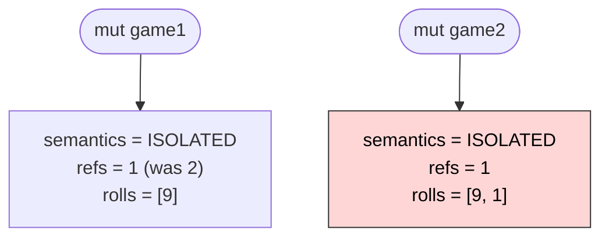

In the image, the red background signals a newly claimed block of memory. The other block is the original, unchanged one.

The new block will only be referenced by the changing variable (`game2`) and receives a `refs` counter of 1. Because `game2` has been reassigned, the old structure’s `refs` counter is decremented by one.

And this is how we can play two isolated bowling games even though we only explicitly created one.

## Reference Semantics

When a structure is instantiated and assigned to a `ref` variable, on the other hand, it will be flagged as `SHARED`. This means that multiple `ref` variables may reference the same (shared) structure and no implicit copying will be made.

Here is an example of usage:

```clawr
ref game1 = BowlingGame() // Creates a new `SHARED` memory structure
game.roll(droppingPins: 9)
print(game1.score) // 9

ref game2 = game // References the same structure
game2.roll(droppingPins: 1) // Mutation does not cause a copy
print(game1.score) // 10
```
Let’s follow the state of the memory for each line of code in the example. First a `BowlingGame` object is instantiated and assigned to the `game1` variable. We can illustrate that as follows:

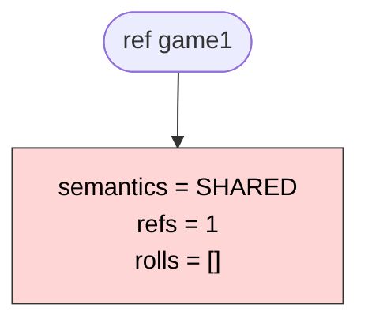

The memory is structured exactly the same way as for a `ISOLATED` variable and the `is_a` (elided here) and `refs` properties have the same purposes. The only difference is the value of the `semantics` flag. In this case we use `SHARED` which has implications when we assign this block to multiple variables.

The second line logs a roll of the bowling ball, which knocks down 9 pins:

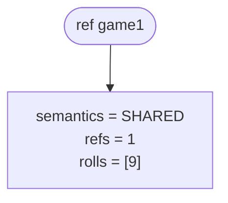
When the other variable is assigned:

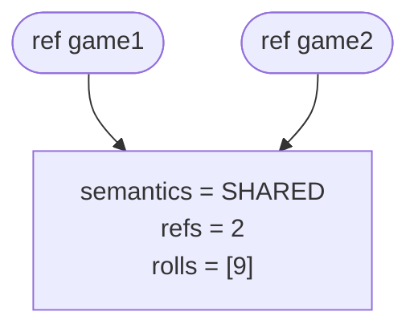

And when the next roll is logged it updates the shared memory, affecting both variables:

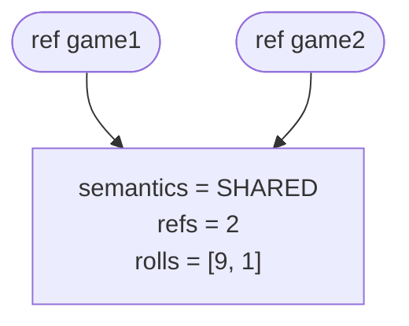

This did not trigger a copy in this case. Because the variables are `ref`—and the memory is flagged as `SHARED`—the contract is different than that of `mut` variables.

A `mut` variable has to be isolated: it must not be changed by changing other variables, and no other variables may change when *it* is changed. This is a powerful guarantee that makes local reasoning possible.

But the `ref` contract requires that a single entity can be referenced (and modified) from multiple locations. It must *not* be copied (unless explicitly requested to) or the contract is broken.

# Weak References

Weak references are necessary to avoid leaking when reference cycles are possible. If two objects in memory have (strong) references to each other, the runtime will not know to deallocate them, and their memory will have “leaked.” That memory can no longer be used for anything as long as the program runs. It will not be deallocated until the program exists and all its memory is reclaimed by the operating system.

A `weak` reference is not reference-counted, but is set to `null` when the referenced object goes out of scope. This means that cycles are safe from memory leakage as long as at least one of the references in each cycle is `weak`.

## Implementation

The implementation is much like Pepparholm, the artificial island that was created for the bridge from Malmö to Copenhagen. When you come off the bridge at Pepparholm, you are not at your destination, you will need to pass through a tunnel (a second water crossing) before you arrive in Copenhagen, Denmark.

The `weak` reference implementation also uses a stepping-stone that requires passing through a second junction (pointer) to get to the true destination.

Every `object` and `struct` contains an optional `__clawr_weak_island` structure. [^side-table] This structure contains a pointer back to the main structure, and a reference-counter that tracks the `weak` references to the object in memory. This establishes a reference cycle, but this cycle is safe because it is kept under strict control.

[^side-table]: Swift and the AIs call this a “side table,” but it’s not a table. It is essentially Pepparholm: a tiny structure/manufactured island, where the bridge from Malmö ends before it connects through another link (the tunnel) to the real destination: Copenhagen, Denmark.

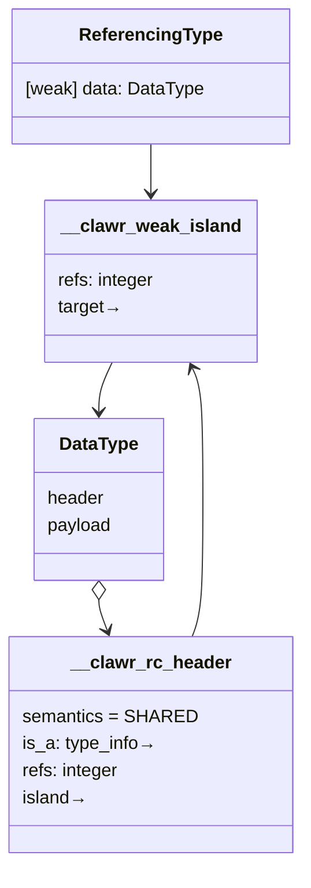

When the first `weak` reference is established, the `__clawr_weak_island` structure is created with a reference-counter of 1, and the main object is updated to reference it. (The main object might be counted as well, but it is not necessary. If it is, the reference-counter should start at 2.)

When subsequent `weak` references are established, the reference-counter is incremented, and when they are reassigned or descoped, the counter is decremented. The structure is however not necessarily deallocated when the counter reaches zero. Instead it is deallocated with the main object.

If the main object is deallocated when the reference-counter is non-zero, the structure will *not* be deallocated. Instead it will be deallocated when the reference-counter reaches zero (i.e. when all `weak` references have been removed).

Adding the main object to the reference-counter might simplify this logic. Then the counter would be decremented when the object itself goes out of scope as well as when `weak` references are removed. Whether is is caused by the references or by the object itself, the `__clawr_weak_island` structure is deallocated as soon as the counter reaches zero.

Whether the object is included in the counter is—at this time—a purely aesthetic choice. It may be prudent to perform some analysis/tests of the performance ramifications before settling on the implementation.

Here is a sketch of how it might be implemented in C (with the object included in the counter):

```c
#ifdef DEBUG
#define assert(expectation) if (!expectation) { exit(EXIT_FAILURE); }
#else
#define assert(_) /* Assertions removed for release */
#endif 

typedef struct {
    void* target;
    atomic_uintptr_t refs; // Counts the `weak`references to object
} __clawr_weak_island;

typedef struct {
    // From existing runtime:
    atomic_uintptr_t refs;
    __clawr_type_info* is_a;

    /// @brief the Pepparholm island for weak references
    __clawr_weak_island* island;
} __clawr_rc_header;

__clawr_weak_island* createWeakRef(__clawr_rc_header* target) {
    // Weak references are only needed (or possible) for `ref` variables
    assert((target->refs & __clawr_ISOLATION_FLAG) == __clawr_SHARED);

    if (target->island) {
	    atomic_increment(&target->island->refs);
    } else {
        target->island = alloc(sizeof(__clawr_weak_island));
	    target->island->target = target;
	    atomic_init(target->island->refs, 2);
    }
    return target->island;
}

void* releaseRC(__clawr_rc_header* header) {
    // See implementation in runtime.md
    // ... if refs reaches 0:
    {
	    __clawr_weak_island* island = header->island;
	    if (island) {
	        island->target = NULL;

	        // The target's reference is gone
	        releaseWeakRef(island);
	    }
        free(header);
    }
    return NULL;
}

void releaseWeakRef(__clawr_weak_island* island) {
	// Note: atomic_decrement() returns the old value, not the new.
	// So to check if there are zero references, we compare the old
	// value with 1, which is equivalent to comparing the new value with 0.
    if (atomic_decrement(&island->refs) == 1) {
        free(island);
    }
}

void* getTarget(__clawr_weak_island* island) {
	if (!island) return NULL;
	return island->target;
}
```

> [!warning]
> The above code is a sketch. It will probably contain bugs. You should probably be especially concerned about atomicity/concurrent updates. In particular, I believe that the `else` branch in `createWeakRef` may need to set an atomic flag to avoid creating another island for the same target.

When a `weak ref` variable is assigned, the runtime executes `createWeakRef(referencedObject)` and assigns the address of the created `__clawr_weak_island` structure to the variable, not the address of the `referencedObject` itself. When a `weak ref` is later reassigned or exits scope, the runtime calls `releaseWeakRef(island)`. This also happens when the target is freed.

When a `weak ref` variable is looked up, it is always done through the `lookupTarget(island)` call. If a field or a method is executed, the same lookup must be repeated before looking up the field or method in the actual object. It should probably be recommended to always look up the variable only once when making multiple calls to the same weakly referenced object. That way, the object is retained by at least one variable and cannot suddenly be freed (and the lookup be `NULL`).

### Synchronisation

The `refs` counters need to be atomic. (The [PoC implementation](https://github.com/clawrlang/clawr-poc) uses the `stdatomic` library for optimistic concurrency.)

If multiple references are added and/or removed at the same time, the `refs` counter could easily be corrupted otherwise. The question is whether more of the logic needs to be protected.

When an object is deallocated (freed), it will not have any references to it, so `free(object)` should not need protection.

Suppose, however, that there is one single variable reference to an object, and two processes access that variable in parallel. One process discards the variable that holds the reference, but the other is assigning the object to a new variable. If the process that adds a reference increments the `refs` counter first, there should be no problem. But if the decrement happens first, there could be an issue.

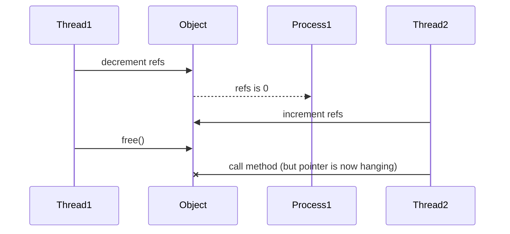

Thread 1 decrements the counter to zero and prepares to deallocate the object, but then the thread is halted and Thread 2 increments the counter. The solution to this scenario might be to check the increment and see that it returns zero (0) because it was just decremented, and now it is incrementing from zero. That means that the object is in the process of being deallocated,  but the deallocation was interrupted before the variable was cleared/reassigned.

Would always reassigning first and deallocating later make the code simpler? No, probably not. A different process might have accessed the object just before it was reassigned. And then be interrupted until after the object is freed:

Thread 1 looks up the object but does not assign it to a new variable. It just calls a method on the object or reads/updates one of its fields. Thread 2 interrupts Thread 1 just before the method is called and reassigns the variable. Now the object may be freed before Thread 1 gets to continue. And it’s hence looking for a method in deallocated memory. Should Thread 1 increment the `refs` counter before calling the method? That doesn’t feel right though.

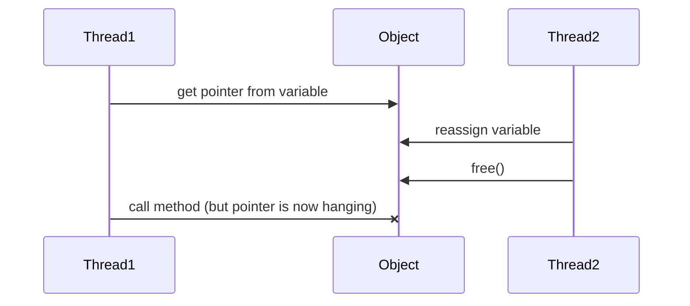
