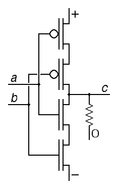

There are many possible ternary gates.

Check out the page on [Ternary Logic](https://louis-dr.github.io/ternlogic.html) as defined by [Louis Duret-Robert](https://louis-dr.github.io/index-ternary.htmll).

## Dual-input gates:

There are 16 ($2^4$) possible two-input binary gates and 19,683 ($3^9$) possible ternary gates. Fortunately, almost all gates are can be ignored as they can be constructed by combining other gates. The aforementioned [Ternary Logic page](https://louis-dr.github.io/ternlogic.html) lists 6 binary gates and 12 ternary gates—half of which are the inverted version of the other half—as “useful.”

Here is a truth-table for the 6 **not inverted** ternary gates. To get the values for the inverted versions (NOR, NAND, NSUM…) just switch the `+`'es and `-`'es where they appear.

| $A$ | $B$ | $A + B$ | $A \times B$ | $A \oplus B$ | $A \otimes B$ | $A \boxplus B$ | $A \boxtimes B$ |
| --- | --- | ------- | ------------ | ------------ | ------------- | -------------- | --------------- |
|     |     | `MAX`   | `MIN`        | `SUM`        | `MUL`         | `ANY`          | `CONS`          |
| `-` | `-` | `-`     | `-`          | `+`          | `+`           | `-`            | `-`             |
| `-` | `0` | `0`     | `-`          | `-`          | `0`           | `-`            | `0`             |
| `-` | `+` | `+`     | `-`          | `0`          | `-`           | `0`            | `0`             |
| `0` | `-` | `0`     | `-`          | `-`          | `0`           | `-`            | `0`             |
| `0` | `0` | `0`     | `0`          | `0`          | `0`           | `0`            | `0`             |
| `0` | `+` | `+`     | `0`          | `+`          | `0`           | `+`            | `0`             |
| `+` | `-` | `+`     | `-`          | `0`          | `-`           | `0`            | `0`             |
| `+` | `0` | `+`     | `0`          | `+`          | `0`           | `+`            | `0`             |
| `+` | `+` | `+`     | `+`          | `-`          | `+`           | `+`            | `+`             |

### Dual-input Gates Identities

$$A + A = A \times A = A \boxplus A = A \boxtimes A = A$$
$$A \oplus A= \neg A$$
$$A + \neg A = |A|$$
$$A \times \neg A = A \otimes \neg A = \neg |A|$$
$$A \oplus \neg A = A \boxplus \neg A = A \boxtimes \neg A = 0$$

$$\neg (A + B) = \neg A \times \neg B$$
$$\neg (A \times B) = \neg A + \neg B$$
$$\neg (A \boxtimes B) = \neg A \boxtimes \neg B$$
$$\neg (A \boxplus B) = \neg A \boxplus \neg B$$
$$A \otimes B = (A + \neg B) \times (\neg A + B) = \neg ((A + B) \times \neg (A \times B))$$
$$\neg (A \otimes B) = (A + B) \times \neg (A \times B)$$
$$A \times (B + C) = A \times B + A \times C$$

[see proof](distributivity.md#and--or)

$$A \otimes (B \oplus C) = A \otimes B \oplus A \otimes C$$

[see proof](distributivity.md#mul--sum)

### Gates as Arithmetics

Gate logic is usually called ternary *algebra*, as if it had something to do with variables with unknown values. It would be better named as ternary *arithmetics*.

A gate is an operator much like the four standard arithmetic operators. They just limit each input value to a single digit (be it binary or ternary), rather than accepting the entire real number-line or even the complex plane.

The shape of the symbols imply that the gates approximate standard addition and multiplication. It is a reasonable explanation for three of the six “useful” ternary gates:

> [!info]
> - `MUL` is standard multiplication $x \otimes y = x \cdot y$.
> - `SUM` ($\oplus$) is modular (truncated) addition where either of -1, 0 or +1 is selected as the result. (In modular maths, $-1 \equiv 2 \ mod \ 3$).
> - `ANY` ($\boxplus$) is clamped addition, limited to +/- 1.
>
> - Binary `AND` is standard multiplication, like `MUL` but without negative values.
> - Binary `OR` is clamped addition, like `ANY` but with no negative values.
> - Binary `XOR` is modular (truncated) addition just like a positive-only  `SUM`.

The ternary `OR` and `AND` gates surprisingly break the pattern. *In binary logic gates*, they can indeed be seen as clamped addition and simple multiplication respectively (and that is how I’ve always understood them). But in ternary logic, they return the *maximum* or *minimum* of the input values. This is not easily explained as addition or multiplication at all.

The same is true for `CONS`. The symbol implies multiplication, but it is hard to see it as such. Maybe it *is* possible though? It is like an `AND` to `ANY`’s `OR` (if you see zero as the false value and `+` and `-` as different true values). It feels farfetched, but there might be something useful it we follow that thought to the end?

Here is a schematic of a simple `NCONS` gate $c = \neg (a \boxplus b)$. Taken from <https://homepage.cs.uiowa.edu/~dwjones/ternary/logic.shtml>. An `NCONS` gate requires fewer transistors than a `CONS` gate would. This make it more suitable as a fundamental component in the substrate. Just as basing binary circuits on `NAND` / `NOR` is preferred over `AND` / `OR`. Physics seems to have a preference for the logical negative.

## Single-input gates:

There are 4 ($2^2$) single-input binary gates and 27 ($3^3$) ternary dito. The binary gates are `CLR` (always `0`), `MRK` (always `1`), `BUF` (output = input) and `NOT` (output is the opposite of input). Only `NOT`is really useful.

A few of the 27 ternary gates and their symbols are listed below in the form of truth tables.

The inverters: a simple inverter and the positive and negative biased inverters:

| $A$ | $\neg A$ | $\neg^+ A$ | $\neg^- A$ |
| --- | -------- | ---------- | ---------- |
|     | `NOT`    | `PNOT`     | `NNOT`     |
| `-` | `+`      | `+`        | `+`        |
| `0` | ``0``    | `+`        | `-`        |
| `+` | `-`      | `-`        | `-`        |
Absolute value, clamp up and clamp down

| $A$ | $\lvert A \rvert$ | $\lceil A \rceil$ | $\lfloor A \rfloor$ |
| --- | ----------------- | ----------------- | ------------------- |
|     | `ABS`             | `CLU`             | `CLD`               |
| `-` | `+`               | `0`               | `-`                 |
| `0` | `0`               | `0`               | `0`                 |
| `+` | `+`               | `+`               | `0`                 |
Also useful are clamped increment and decrement, rotate up and rotate down:

| $A$ | $A^+$ | $A^-$ | $A^╯$ | $A^╮$ |
| --- | ----- | ----- | ----- | ----- |
|     | `INC` | `DEC` | `RTU` | `RTD` |
| `-` | `0`   | `-`   | `0`   | `+`   |
| `0` | `+`   | `-`   | `+`   | `-`   |
| `+` | `+`   | `0`   | `-`   | `0`   |
Is positive, is zero and is negative (`ISN` is the same gate as `NNOT`):

| $A$ | $A^{=+}$ | $A^{=0}$ | $A^{=-}$ |
| --- | -------- | -------- | -------- |
|     | `ISP`    | `ISZ`    | `ISN`    |
| `-` | `-`      | `-`      | `+`      |
| `0` | `-`      | `+`      | `-`      |
| `+` | `+`      | `-`      | `-`      |

### Single-input Gate Identities

$$\lvert A \rvert = \neg (A \times \neg A) = A \otimes A$$
| $A$ | $\neg A$ | $A \times \neg A$ | $\neg (A \times \neg A)$ |
| --- | -------- | ----------------- | ------------------------ |
| `-` | `+`      | `-`               | `+`                      |
| `0` | `0`      | `0`               | `0`                      |
| `+` | `-`      | `-`               | `+`                      |

$$A^+ = A \boxplus +$$
$$A^- = A \boxplus -$$
$$A^╯ = A \oplus +$$
$$A^╮ = A \oplus -$$
$$A^{=+} = A \boxtimes +$$
$$A^{=-} = A \boxtimes -$$
$$A^{=0} = A^╯ \boxtimes + = A^╮ \boxtimes -$$
